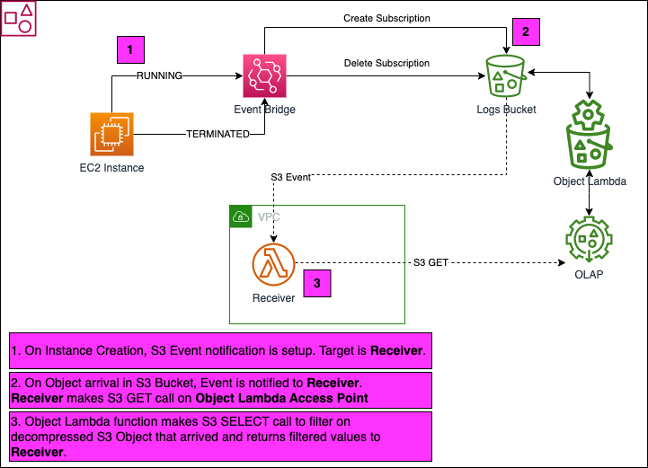

# Event-driven Log processing CDK project

This project is developed using AWS CDK with TypeScript language binding.

## Purpose
`AWS EMR Cluster` when launched dumps log files in S3 Bucket.

The aim is to detect `EMR Cluster` log files and process specific log events as and when they are available.

To address this scenario, `Event-driven invocation` paired with AWS serverless capabilities are utilised.

The below diagram depicts the solution architecture implemented in this project:



* EC2 Instance simulates creation of `EMR Cluster` Job
  * EventBridge rule is setup for EC2 Instance `RUNNING` state
  * EventBridge rule creates `S3 Event Notification` on S3 Bucket where logs are collected
    * `EMR Cluster` logs are simulated by simple AWS CLI script that copies files to S3 Bucket
* EC2 Instance simulates termination of `EMR Cluster` Job
  * EventBridge rule is setup for EC2 Instance `TERMINATED` state
  * EventBridge rule deletes `S3 Event Notification` on S3 Bucket where logs are collected
* S3 Object Lambda Access Point `(OLAP)`
  * Supporting Access Point is also created
* A Lamba function `(a.k.a Object Lambda)` is created and configured with `OLAP`
  * For every S3 GET call on `OLAP`, the Object Lambda function will execute
    * S3 Select on S3 Bucket to Decompress `*.gz` files and query log records that match specific `search string`
    * Object Lamda function aggregates and returns the filtered log records
* A Lambda function `Receiver` receives `S3 Event` whenever an Object arrives in S3 Bucket
  * `Receiver` makes a S3 GET call on `OLAP`
  * Log records returned by `OLAP` are printed in CloudWatch Log Stream
  
## Deployment steps
* Setup AWS CLI v2
* Setup AWS CDK (latest version)
* Clone this repository
* Change `Account` and `Region` entries in `bin/ec2event.ts`
* Ensure following entries in `cdk.context.json` are updates as per your needs:

```
  "event_bucket": "rd-bucket1",
  "vpc_cidr": "192.168.0.0/16",
  "s3_ap_name": "event-ap",
  "s3_olap_name": "event-olap",
```

* Synthesize code
```
cdk synth
```
* Run `deploy.sh` to launch 3 CloudFormation stacks created by this project

## Useful commands

* `npm run build`   compile typescript to js
* `npm run watch`   watch for changes and compile
* `npm run test`    perform the jest unit tests
* `cdk deploy`      deploy this stack to your default AWS account/region
* `cdk diff`        compare deployed stack with current state
* `cdk synth`       emits the synthesized CloudFormation template
